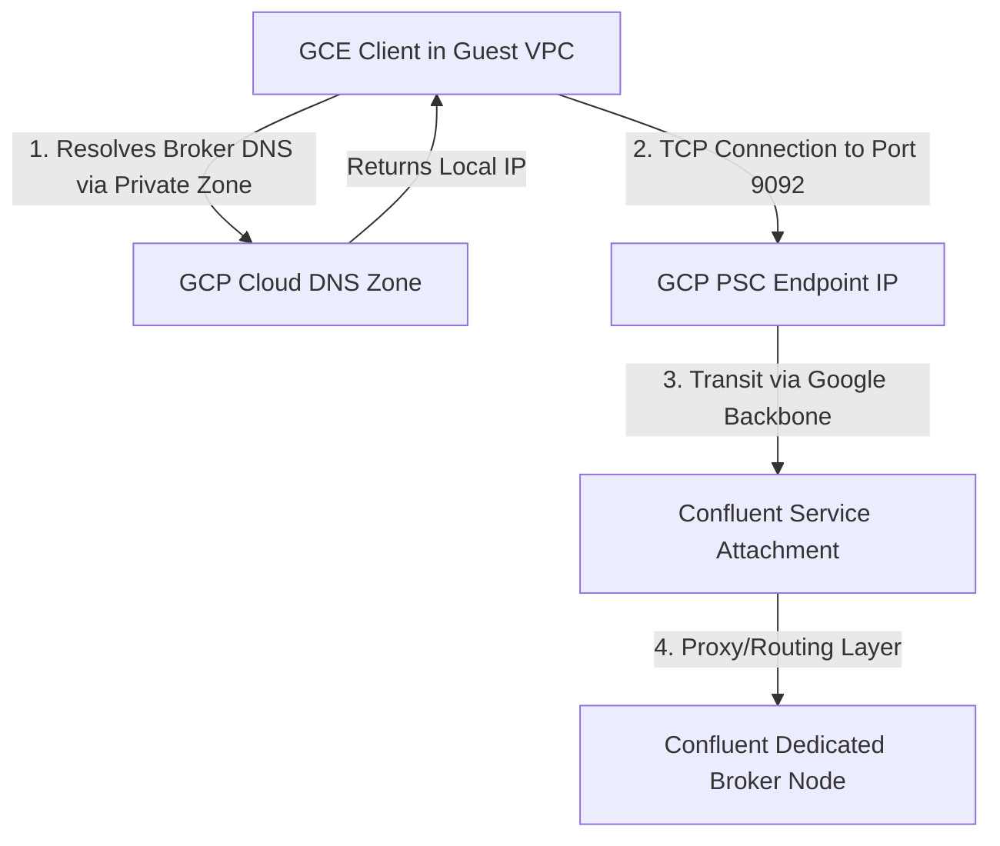

# Kafka Platform Engineer — Practical Assessment Write-ups

## Section 1

### 1.1 Durability basics
**What does acks=all actually wait for?**

`acks=all` (or `acks=-1`) forces the producer to block until the partition leader **and all active members of the In-Sync Replica (ISR) pool** acknowledge the append operation. When paired with `min.insync.replicas=2`, a minimum of **2 healthy brokers** (the leader plus at least 1 synchronized follower) must commit the record to their local logs before the cluster issues a success acknowledgment to the client.

**What happens when one broker holding a replica goes offline?**

With a Replication Factor of 3 (`RF=3`), losing a single broker shrinks the active ISR pool from 3 down to 2. Because this still satisfies the `min.insync.replicas=2` threshold, the cluster state updates gracefully. **Production pipelines continue running normally** with zero data loss and no producer runtime exceptions.

**What happens when two brokers go offline?**

When two brokers go offline simultaneously, the ISR pool shrinks to 1 (the remaining partition leader). Because the active ISR size (1) is now strictly less than the configured `min.insync.replicas=2`, the leader broker will reject incoming append requests from producers using `acks=all`. The producer client will receive a `NotEnoughReplicasException` (or `NotEnoughReplicasAfterAppendException`). Note that data read availability remains intact: consumers can still read existing committed data from the single remaining alive broker.

**Why is min.insync.replicas=2 (not 3) a common choice?**

Setting `min.insync.replicas=3` requires absolute synchronization across all nodes. Under that constraint, the failure or maintenance of any single broker instantly triggers a total write outage. Configuring it to 2 provides an optimal structural balance:
* **Fault Tolerance:** Safely tolerates the loss of exactly 1 broker without dropping service.
* **Durability:** Guarantees that at least 2 distinct physical copies of the data exist before a write is confirmed.
* **Operational Agility:** Allows seamless execution of rolling restarts, security patching, and infrastructure maintenance without interrupting data ingestion.

---

### 1.2 Confluent Cloud on GCP — network path
**Path from a GCE client in your VPC to the cluster:**



1. **DNS Resolution:** The GCE client initiates a connection to the bootstrap URL (e.g., `lkc-xxxx.us-central1.gcp.confluent.cloud:9092`). The request hits the GCP Cloud DNS Private Zone attached to the client VPC, resolving the hostname directly to a local Private Service Connect (PSC) endpoint internal IP.
2. **Bootstrap Connection:** The client establishes a TLS session across the local PSC endpoint on port 9092. Traffic transits the GCP network backbone into Confluent's managed infrastructure via their Service Attachment.
3. **Metadata Request:** The initial connection hits Confluent’s internal network load balancers, returning the cluster metadata payload which contains individual, distinct DNS hostnames for each broker in the Dedicated cluster (e.g., `b0-lkc-xxxx.us-central1.gcp.confluent.cloud`).
4. **Per-Broker Connections:** The client loops through the metadata payload and creates direct, parallel, long-lived TCP/TLS sockets to each individual broker using the same local PSC endpoint routing mechanism.

**Private DNS zone convention and VPC attachment:**
Confluent Cloud utilizes a strict split-horizon private DNS zone naming convention, generally following the pattern: `*.p0.us-central1.gcp.confluent.cloud` or `*.lkc-xxxx.us-central1.gcp.confluent.cloud`. This Private DNS Zone **must be explicitly attached to the Client's Application VPC** (the VPC where the GCE workloads reside) so that the local instances can correctly resolve the cluster's endpoints to internal VPC forwarding IPs rather than looking up public IP endpoints.

**Common misconfiguration and how to detect it:**
A frequent operational pitfall is failing to attach the Confluent Private DNS zone to the correct application client VPC, or omitting it entirely. 
* **Detection:** The initial bootstrap handshake might succeed if utilizing an IP address directly, but subsequent broker-specific connections will immediately fail, throwing `LEADER_NOT_AVAILABLE` or unresolvable socket errors.
* **Validation Command:** Execute an explicit name lookup directly from the client workload host:
  ```bash
  nslookup {broker-hostname}
  ```
  An unattached zone will return public endpoints or `NXDOMAIN`, whereas a healthy configuration yields your internal VPC private IP.

---

### 1.3 Producer latency triage
**4 likely causes (ranked most-to-least likely):**

1. **Network Congestion or Elevated Round-Trip Time (RTT):** Physical routing degradation or interface saturation between the application runtime and the cloud brokers.
2. **Stop-the-World JVM Garbage Collection Pauses:** Heavy broker-side garbage collection cycles that freeze application processing threads without reflecting as sustained host CPU utilization.
3. **Producer Batching Configuration Adjustments:** Recent changes or systemic drifts in client parameters (`batch.size` or `linger.ms`) forcing the accumulator to buffer records longer before pushing to the wire.
4. **In-Sync Replica (ISR) Pool Shrinkage:** Replicas falling out of sync, forcing the partition leader to block waiting for slow followers to catch up to fulfill `acks=all`.

**Metric or log line to check for each cause:**
* **Cause 1 (Network):** Inspect the client-side JMX metric `kafka.producer:type=producer-metrics,client-id={id}` -> `request-latency-avg`.
* **Cause 2 (GC Pauses):** Monitor broker-side JMX metric `kafka.log:type=LogFlushStats,name=LogFlushRateAndTimeMs`.
* **Cause 3 (Batching):** Evaluate the client-side performance metric `kafka.producer:type=producer-metrics` -> `batch-size-avg`.
* **Cause 4 (ISR Shrinkage):** Monitor the authoritative cluster health indicator `UnderReplicatedPartitions`.

**Shell command to check for recent GC pauses:**
To check for stop-the-world JVM execution halts directly on the broker host, parse the standard garbage collection log output:
```bash
grep "GC pause" /var/log/kafka/kafkaServer.out | tail -n 50
```
If GC logging is streaming directly to a systemd journal daemon, isolate the Kafka process runtime logs via:
```bash
journalctl -u kafka --since "1 hour ago" --no-pager | grep -i "garbage collection"
```
Alternatively, sample runtime utilization in real-time:
```bash
jstat -gcutil $(pgrep -f "kafka.Kafka") 1000 30
```

---

### 1.4 Ansible change gone wrong
**Why is serial: 3 unsafe here?**

In a 6-broker cluster architecture handling topics with a replication factor of 3 (`RF=3`), restarting 3 brokers simultaneously breaks the availability boundaries of the system. If those 3 targeted nodes happen to hold the complete set of replicas for a specific partition, that partition immediately drops completely offline. **Simultaneous loss of ≥ RF nodes guarantees data unavailability.** As a strict engineering rule, never restart more than RF-1 nodes at the same time. For an `RF=3` topology, `serial: 1` is the only safe execution pattern.

**3 safety checks the play should include:**

1. **Pre-Flight Cluster Health Gating:** Assert that the cluster-wide count of `UnderReplicatedPartitions == 0` before initiating a task on any individual broker. Halt execution immediately if any imbalance is caught.
2. **Post-Restart Synchronous Health Gate:** A blocking, retrying task that forces the playbook to wait until the restarted broker successfully rejoins its assigned ISR pools and the global URP count converges back to 0 before unlocking the next host.
3. **Strict Concurrency Enforcement:** Hardcode linear execution parameters (`serial: 1`) to guarantee that under no circumstances can parallel node bounces occur.

**List the recovery steps in order:**

1. **Terminate the Automation Execution:** Immediately issue an abort/kill command to the running Ansible pipeline to stop additional uncoordinated restarts on the remaining 3 healthy nodes.
2. **Audit & Discover Cluster Health:** Query the cluster topology to pinpoint which specific broker daemons failed to register back online:
   ```bash
   kafka-broker-api-versions.sh --bootstrap-server localhost:9092
   ```
3. **Manual Sequential Node Recovery:** Log into the offline broker instances, inspect local config files for syntax issues, and manually restart the processes one by one:
   ```bash
   systemctl start kafka
   ```
4. **Monitor Log Re-Replication:** Establish a live monitoring loop to ensure that data logs are catching up and under-replicated partition counts are falling:
   ```bash
   watch -n 1 "kafka-topics.sh --bootstrap-server localhost:9092 --describe --under-replicated-partitions"
   ```
5. **Freeze Operations Until Stabilization:** Maintain a strict change freeze until the ISR states across all partitions hit 100% equilibrium.
6. **Post-Incident Remediation:** Refactor the upstream Ansible roles to embed automated JMX/CLI health assertions alongside tight `serial: 1` roll mechanics.

---

### 1.5 ZooKeeper vs KRaft — short check

ZooKeeper in a Kafka cluster manages 
all cluster metadata: broker registration,
controller election, topic partition 
assignments, and ISR lists. It is a 
separate external service that Kafka 
depends on entirely for coordination.

In a KRaft cluster, the Kafka controller 
itself stores and replicates metadata 
using an internal Raft consensus log.
ZooKeeper is completely eliminated.
One or more brokers act as KRaft 
controllers handling all coordination 
internally.

If building a new cluster today I 
would choose KRaft without hesitation.
ZooKeeper is officially deprecated as 
of Kafka 3.5 and removed in Kafka 4.0.
KRaft reduces operational complexity 
(one fewer system to manage), improves 
controller failover speed, and supports 
larger partition counts. I have hands-on 
KRaft experience from my current BOA 
Kafka environment.
